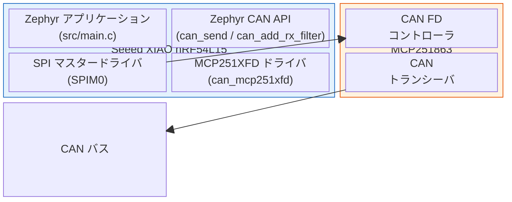
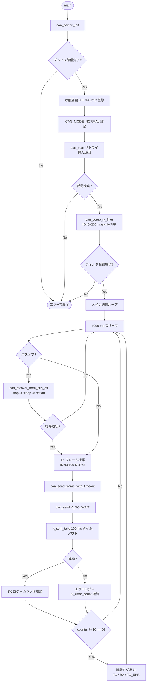
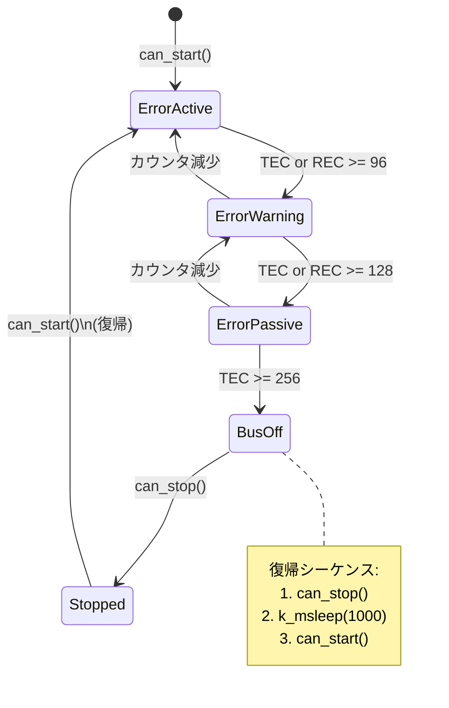
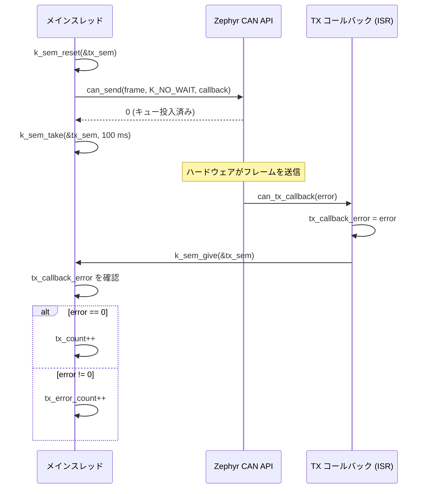

# study-ZephyrCAN

[](https://deepwiki.com/uist1idrju3i/study-ZephyrCAN)

> [English version is here](README.md)

## 動作確認済みハードウェア

以下のハードウェアで study-ZephyrCAN の動作を確認しています:

- [Seeed XIAO nRF54L15](https://wiki.seeedstudio.com/xiao_nrf54l15_sense_getting_started/) (ボードターゲット: xiao_nrf54l15/nrf54l15/cpuapp)
- Microchip [MCP251863](https://www.microchip.com/en-us/product/MCP251863) (CAN FD コントローラ + トランシーバ)

## 開発環境バージョン

- nRF Connect SDK toolchain v3.2.1
- nRF Connect SDK v3.2.1

---

## CAN サンプルアプリケーション

本プロジェクトは、Zephyr RTOS 上で動作する CAN バス送受信サンプルです。nRF54L15 SoC（ネイティブ CAN ペリフェラルなし）が SPI 経由で外部 MCP251863 CAN FD コントローラと通信します。

### システム構成



### ピンアサイン

| 信号 | GPIO | SPI インスタンス | 説明 |
|------|------|-----------------|------|
| SCK | P1.1 | SPI00 | SPI クロック |
| MOSI | P1.2 | SPI00 | SPI データ出力 |
| MISO | P1.3 | SPI00 | SPI データ入力 |
| CS | P1.0 | SPI00 | チップセレクト (アクティブ Low) |
| INT | P1.8 | - | MCP251863 割り込み (アクティブ Low) |
| WS2812 | P1.4-P1.7 | SPI20-SPI30 | LED ストリップデータ (既存) |

> **注意:** ピンアサインはプレースホルダです。フラッシュ前に実際のハードウェア配線と照合してください。

### アプリケーションフロー



### CAN ステートマシン

アプリケーションはコールバックで CAN コントローラのエラー状態を監視し、バスオフ復帰を行います。



### TX 完了フロー

送信はメインスレッドと ISR コールバック間のセマフォベースの同期で行われます。



### ファイル構成

| ファイル | 説明 |
|----------|------|
| `src/main.c` | CAN アプリケーション: 初期化、TX/RX、コールバック、バスオフ復帰 |
| `app.overlay` | Devicetree オーバーレイ: SPI00 + MCP251863、WS2812 LED |
| `prj.conf` | Kconfig: CAN ドライバ、BLE、ログ、ペリフェラル |
| `mcp251xfd.md` | MCP251XFD ドライバ技術ドキュメント (英語) |
| `mcp251xfd.ja.md` | 同ドキュメント日本語版 |

### 設定定数

`src/main.c` で定義:

| 定数 | 値 | 説明 |
|------|----|------|
| `CAN_TX_MSG_ID` | `0x100` | 送信フレームの CAN ID |
| `CAN_RX_FILTER_ID` | `0x200` | 受信フィルタの CAN ID |
| `CAN_RX_FILTER_MASK` | `0x7FF` | フィルタマスク (完全一致) |
| `CAN_TX_INTERVAL_MS` | `1000` | 送信間隔 (ms) |
| `CAN_SEND_TIMEOUT_MS` | `100` | TX 完了タイムアウト (ms) |
| `CAN_INIT_MAX_RETRIES` | `10` | `can_start()` 最大リトライ回数 |
| `CAN_INIT_RETRY_DELAY_MS` | `500` | 初期化リトライ間隔 (ms) |
| `CAN_RECOVERY_DELAY_MS` | `1000` | バスオフ復帰時の待機時間 (ms) |

### Kconfig (prj.conf の CAN セクション)

| シンボル | 値 | 説明 |
|----------|----|------|
| `CONFIG_CAN` | `y` | CAN サブシステム有効化 |
| `CONFIG_CAN_MCP251XFD_MAX_TX_QUEUE` | `8` | TX キュー深度 |
| `CONFIG_CAN_MCP251XFD_RX_FIFO_ITEMS` | `16` | RX FIFO 深度 |
| `CONFIG_CAN_MCP251XFD_INT_THREAD_STACK_SIZE` | `1536` | 割り込みハンドラスタック (デフォルト: 768) |
| `CONFIG_CAN_MCP251XFD_INT_THREAD_PRIO` | `2` | 割り込みハンドラスレッド優先度 |
| `CONFIG_CAN_MCP251XFD_READ_CRC_RETRIES` | `5` | SPI 読み取り CRC リトライ回数 |
| `CONFIG_CAN_DEFAULT_BITRATE` | `500000` | デフォルト CAN ビットレート (500 kbps) |

### TX フレームフォーマット

```
Byte:  [0]    [1]    [2]   [3]   [4]   [5]   [6]   [7]
Data:  CNT_H  CNT_L  0xCA  0xFE  0xDE  0xAD  0xBE  0xEF
       |___________|
        ローリングカウンタ (ビッグエンディアン uint16)
```

- **CAN ID:** `0x100` (標準 11 ビット)
- **DLC:** 8
- **Byte 0-1:** ローリングカウンタ (送信成功ごとに +1)
- **Byte 2-7:** 固定パターン `0xCAFEDEADBEEF`

## ビルド

```bash
west build -b xiao_nrf54l15/nrf54l15/cpuapp
```

## フラッシュ

```bash
west flash
```

> USB またはデバッグプローブで実機を接続する必要があります。

## 参考資料

- [Zephyr CAN API](https://docs.zephyrproject.org/latest/hardware/peripherals/can/index.html)
- [MCP251XFD ドライバドキュメント](mcp251xfd.md) ([日本語](mcp251xfd.ja.md))
- [Microchip MCP251863 製品ページ](https://www.microchip.com/en-us/product/MCP251863)
