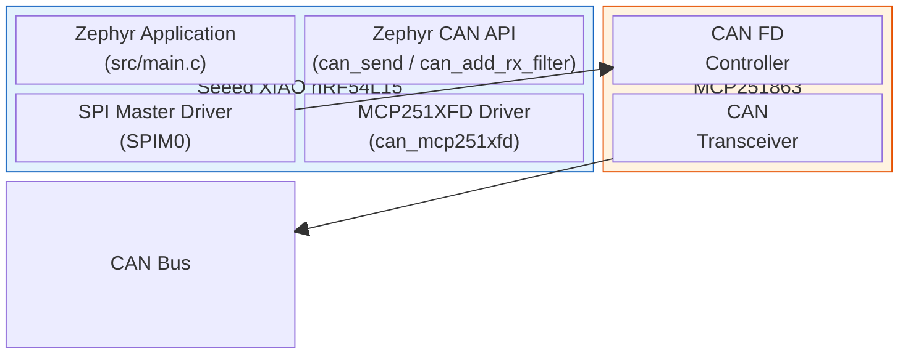
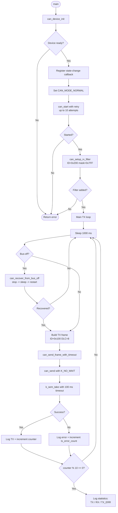
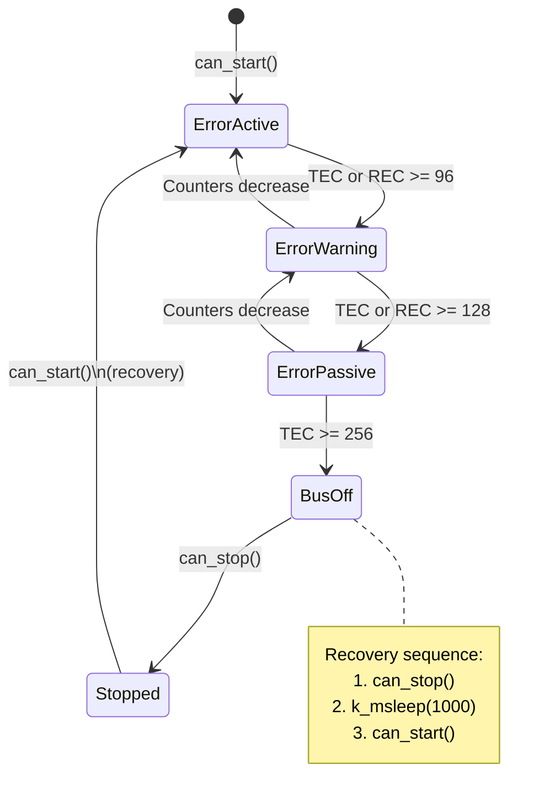
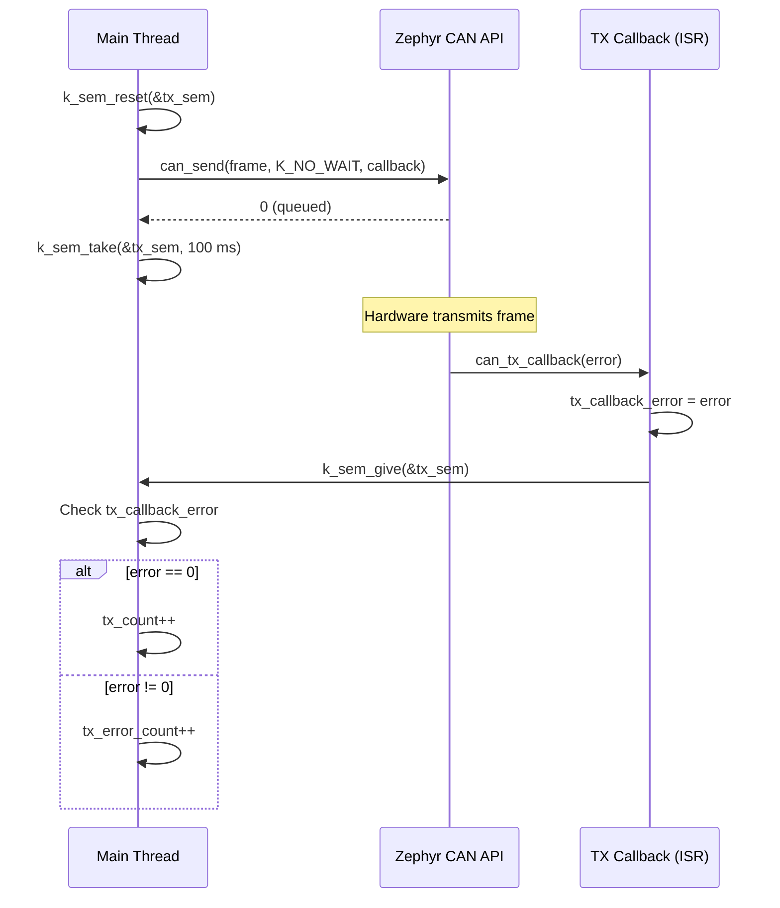

# study-ZephyrCAN

[](https://deepwiki.com/uist1idrju3i/study-ZephyrCAN)

> [Japanese / 日本語版はこちら](README.ja.md)

## Verified Hardware

The following hardware platforms have been tested with OpenBlink:

- [Seeed XIAO nRF54L15](https://wiki.seeedstudio.com/xiao_nrf54l15_sense_getting_started/) (Board target: xiao_nrf54l15/nrf54l15/cpuapp)
- Microchip [MCP251863](https://www.microchip.com/en-us/product/MCP251863) (CAN FD controller + transceiver)

## Development Environment Versions

- nRF Connect SDK toolchain v3.2.1
- nRF Connect SDK v3.2.1

---

## CAN Sample Application

This project provides a complete CAN bus send/receive sample running on Zephyr RTOS. The nRF54L15 SoC (which has no native CAN peripheral) communicates with an external MCP251863 CAN FD controller over SPI.

### System Architecture



### Pin Assignment

| Signal | GPIO | SPI Instance | Description |
|--------|------|-------------|-------------|
| SCK | P1.1 | SPI00 | SPI clock |
| MOSI | P1.2 | SPI00 | SPI data out |
| MISO | P1.3 | SPI00 | SPI data in |
| CS | P1.0 | SPI00 | Chip select (active low) |
| INT | P1.8 | - | MCP251863 interrupt (active low) |
| WS2812 | P1.4-P1.7 | SPI20-SPI30 | LED strip data (existing) |

> **Note:** Pin assignments are placeholders. Verify against your actual hardware wiring before flashing.

### Application Flow



### CAN State Machine

The application monitors the CAN controller's error state via a callback and handles bus-off recovery.



### TX Completion Flow

Transmission uses a semaphore-based synchronization between the main thread and the ISR callback.



### File Structure

| File | Description |
|------|-------------|
| `src/main.c` | CAN application: init, TX/RX, callbacks, bus-off recovery |
| `app.overlay` | Devicetree overlay: SPI00 + MCP251863, WS2812 LEDs |
| `prj.conf` | Kconfig: CAN driver, BLE, logging, peripherals |
| `mcp251xfd.md` | MCP251XFD driver technical documentation |
| `mcp251xfd.ja.md` | Same documentation in Japanese |

### Configuration Constants

Defined in `src/main.c`:

| Constant | Value | Description |
|----------|-------|-------------|
| `CAN_TX_MSG_ID` | `0x100` | CAN ID for transmitted frames |
| `CAN_RX_FILTER_ID` | `0x200` | CAN ID accepted by the RX filter |
| `CAN_RX_FILTER_MASK` | `0x7FF` | Filter mask (exact match) |
| `CAN_TX_INTERVAL_MS` | `1000` | Transmission interval (ms) |
| `CAN_SEND_TIMEOUT_MS` | `100` | TX completion timeout (ms) |
| `CAN_INIT_MAX_RETRIES` | `10` | Max `can_start()` retry attempts |
| `CAN_INIT_RETRY_DELAY_MS` | `500` | Delay between init retries (ms) |
| `CAN_RECOVERY_DELAY_MS` | `1000` | Delay during bus-off recovery (ms) |

### Kconfig (CAN section in prj.conf)

| Symbol | Value | Description |
|--------|-------|-------------|
| `CONFIG_CAN` | `y` | Enable CAN subsystem |
| `CONFIG_CAN_MCP251XFD_MAX_TX_QUEUE` | `8` | TX queue depth |
| `CONFIG_CAN_MCP251XFD_RX_FIFO_ITEMS` | `16` | RX FIFO depth |
| `CONFIG_CAN_MCP251XFD_INT_THREAD_STACK_SIZE` | `1536` | Interrupt handler stack (default: 768) |
| `CONFIG_CAN_MCP251XFD_INT_THREAD_PRIO` | `2` | Interrupt handler thread priority |
| `CONFIG_CAN_MCP251XFD_READ_CRC_RETRIES` | `5` | SPI read CRC retry count |
| `CONFIG_CAN_DEFAULT_BITRATE` | `500000` | Default CAN bitrate (500 kbps) |

### TX Frame Format

```
Byte:  [0]    [1]    [2]   [3]   [4]   [5]   [6]   [7]
Data:  CNT_H  CNT_L  0xCA  0xFE  0xDE  0xAD  0xBE  0xEF
       |___________|
        Rolling counter (big-endian uint16)
```

- **CAN ID:** `0x100` (standard 11-bit)
- **DLC:** 8
- **Bytes 0-1:** Rolling counter (increments on each successful TX)
- **Bytes 2-7:** Fixed pattern `0xCAFEDEADBEEF`

## Build

```bash
west build -b xiao_nrf54l15/nrf54l15/cpuapp
```

## Flash

```bash
west flash
```

> Requires physical hardware connected via USB or a debug probe.

## References

- [Zephyr CAN API](https://docs.zephyrproject.org/latest/hardware/peripherals/can/index.html)
- [MCP251XFD Driver Documentation](mcp251xfd.md) ([Japanese](mcp251xfd.ja.md))
- [Microchip MCP251863 Product Page](https://www.microchip.com/en-us/product/MCP251863)
